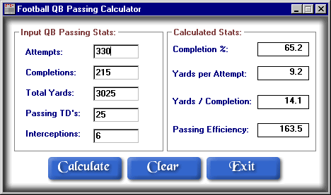



## QB Passing Calculator

### Description

This is a Football Quarterback Passing Calculator.This application will calculate completion percentage, yards per Attempt, yards per completion, and passing Efficiency.
 
### More Info
 

             |
---                |---
**Submitted On**   |2002-11-08 18:47:42
**By**             |[Randy McCleary](https://github.com/Planet-Source-Code/PSCIndex/blob/master/ByAuthor/randy-mccleary.md)
**Level**          |Intermediate
**User Rating**    |5.0 (10 globes from 2 users)
**Compatibility**  |VB 6\.0
**Category**       |[Math/ Dates](https://github.com/Planet-Source-Code/PSCIndex/blob/master/ByCategory/math-dates__1-37.md)
**World**          |[Visual Basic](https://github.com/Planet-Source-Code/PSCIndex/blob/master/ByWorld/visual-basic.md)
**Archive File**   |[QB\_Passing1653581042003\.zip](https://github.com/Planet-Source-Code/randy-mccleary-qb-passing-calculator__1-48985/archive/master.zip)

